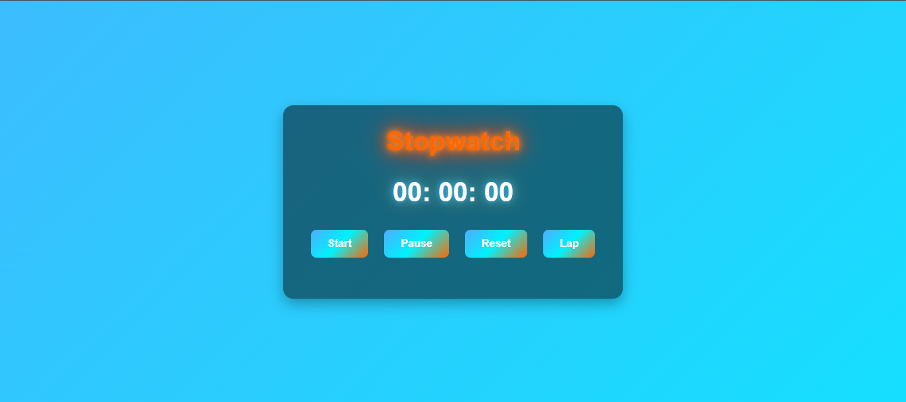
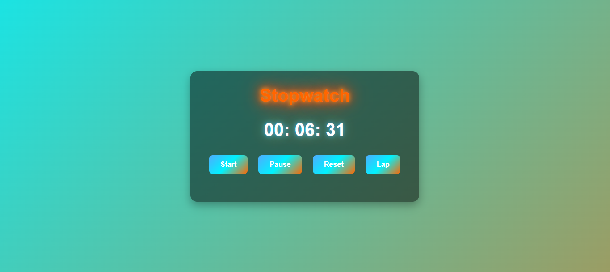
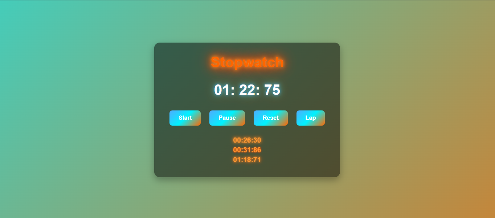

# Prodigy InfoTech Web Development Internship –   
## Stopwatch Application  

This repository contains my solution for **Task 2** of the Prodigy InfoTech Web Development Internship.  
The goal of this task was to **build a stopwatch web application** using core web technologies (**HTML, CSS, JavaScript**).  

---

## 🚀 Features  
- Start, Pause, and Reset stopwatch functions  
- Record Lap times with smooth fade-in animation  
- Animated gradient background for a modern aesthetic  
- Neon glowing stopwatch display  
- Gradient glowing buttons with hover effects  
- Responsive, user-friendly UI  

---

## 🛠️ Tech Stack  
- **HTML5** – Structure  
- **CSS3** – Styling, gradients, animations  
- **JavaScript (ES6)** – Stopwatch logic & interactivity  

---

## 📸 Preview  
![Stopwatch Preview]    
  

---

## 🔗 Live Demo  
 [View Stopwatch App](https://keabetswemp.github.io/prodigy_wd_02/)  


---

## Getting Started  
1. Clone this repository:  
   ```bash
   git clone https://github.com/KeabetsweMP/prodigy_wd_02.git

